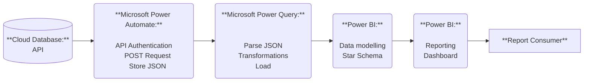

🔧 Design Choices

1. **API-first approach:**

    Direct SQL connections were not available because the database is hosted in a cloud environment that doesn’t support direct SQL access.
    Therefore, REST API endpoints were used as the primary data source. The API requires authentication with a private key that must be passed on login. 

2. **Power Automate for extraction:**

    Power Automate handles daily recurring API calls and stores the raw outputs as JSON files in a controlled environment.
    It first authenticates against the API to retrieve a token, then sends the request to the API. The API responds with JSON, which is stored as a .json file.

3. **Power Query for ETL:**

    Power Query provides strong JSON handling and integrates seamlessly with Power BI.
    A master query extracts the raw JSON file, while query references are used to create fact and dimension tables. Some static dimension attributes were merged from CSV downloads exported via the web interface of the database.

4. **Power BI for reporting:**

    Power BI was used for data modeling and reporting.
    The model started as a snowflake schema, but was later simplified into a star schema to better align with end-user needs. Denormalization was applied to flatten the structure.
    Since Power BI is optimized for star schemas, this also improves performance (although the impact is negligible at the current scale of ~1,200 fact rows).

5. **Security & Privacy:**

    API keys and credentials are not stored in the repository. All sample data is anonymized or generated for demonstration purposes only.

6. **Limitations & Future Improvements:**
    Current dataset size is small; performance impact is negligible.
    For larger volumes, a SQL staging layer or Azure Data Lake could be introduced. A SQL staging layer would allow historical snapshots, better performance, and easier integration of multiple data sources.
   

---

