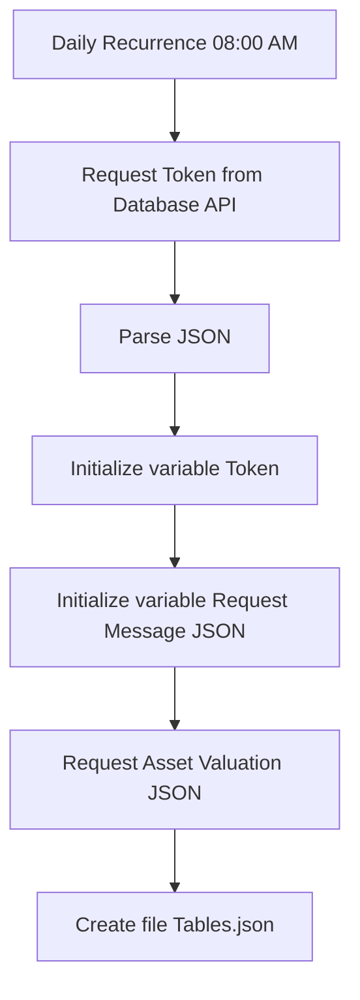

⚡ **Power Automate flow description:**

- Trigger – The flow runs daily at 08:00 AM.

- Authentication – Request token from the API and parse JSON response.

- Initialize variables – Store token and prepare the request payload.

- Data request – Call the API to fetch valuation data.

- Storage – Save the raw JSON response into Tables.json for further processing in Power Query.

---
**Diagram:**

