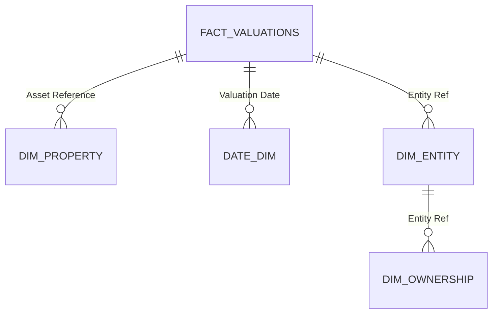

# 📊 Data Model Documentation

This section describes the data model used in the Power BI report.
Table and column names have been **anonymized** for demonstration purposes. 

---

 

---

## 📊 Fact Table

### **Fact\_Valuations**

* Central fact table containing valuation metrics.
* **Grain:** One row per asset per valuation date.
* **Key columns:**

  * `Asset Reference` → primary key of the fact table and foreign key to **Dim\_Property**
 

This table is connected to multiple dimension tables to provide business context for reporting.

---

## Dimension Tables

### 📋 **Dim\_Property**

* Contains static attributes of each property/asset.
* **Key columns:**

  * `Asset Reference` → primary key, links to Fact\_Valuations

Provides property-level context for valuations.

---

### 📋 **Dim\_Entity** *(Bridge Table)*

* Serves as a **bridge table** between valuations and ownership.
* Enables **bi-directional filtering** between Fact\_Valuations and Dim\_Ownership.
* **Key columns:**

  * `Legal Entity Reference` → primary key
  * `Legal Entity Name` → foreign key to Dim_Ownership

This design allows reporting across ownership structures without creating ambiguous relationships.

---

### 📋 **Dim\_Ownership**

* Contains information about fund ownership and legal entity relationships.
* **Attributes:**

  * `Fund`
  * `Ownership Percentage`
  * `Legal Entity Name` → primary key

Connected via **Dim\_Entity**, ensuring flexible analysis of ownership across funds and entities.

---

### 📅 **Date**

* Standard Power BI date dimension.
* Used to enable time intelligence and period-over-period calculations.

---

## 📐 Schema Design

* The model follows a **star schema** structure with one fact table and multiple dimension tables.
* A **bridge table (Dim\_Entity)** was introduced to handle the many-to-many relationship between properties and ownership.
* This design simplifies DAX calculations and improves report performance.

---

## 🔑 Key Design Considerations

* **Star schema** chosen over snowflake for simplicity and performance.
* **Bridge table** ensures correct ownership filtering without circular dependencies.
* **Date dimension** provides a robust foundation for time-based analysis.
* Names have been anonymized for demonstration and privacy.

---

