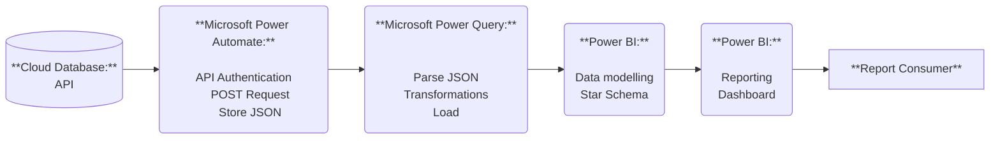
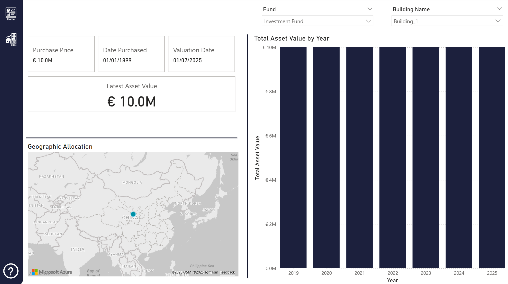
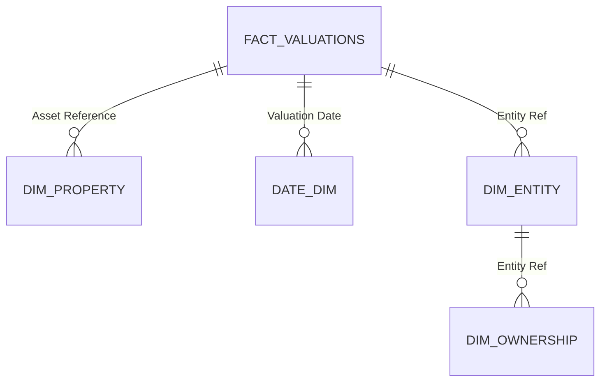
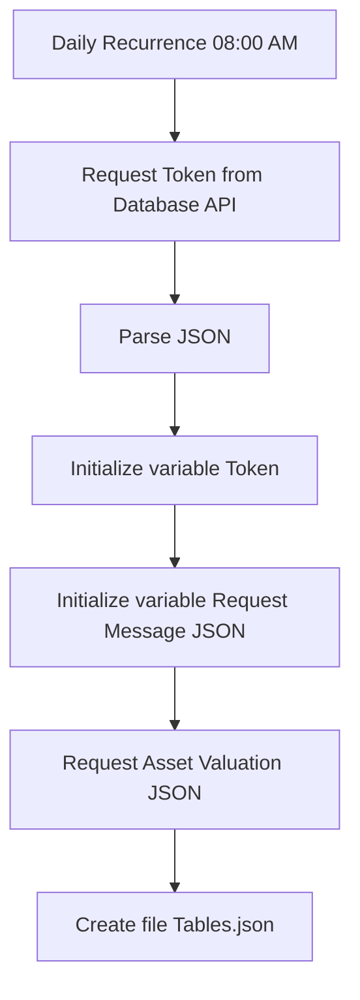

**Real Estate Valuations Automation (Power Automate + Power BI)**

📌 Project Overview

This project demonstrates an end-to-end automation pipeline for real estate valuation data, combining:

- **Power Automate** to call **API endpoints** and store the results as JSON files.
- **Power Query** to parse, clean, and transform the raw JSON data (ETL).
- **Power BI** to model the processed data and provide interactive dashboards.

The goal is to replace manual workflows with a reproducible pipeline that delivers reliable, daily valuation insights.

Problem:

- Valuation data was **not centrally available** in a **structured way**.
- **Direct SQL connections** to the source system were **not possible**.
- **Manual downloads** and data preparation were repetitive and error-prone.

Solution:

- Automated **API calls** using **Power Automate**, retrieving JSON data from endpoints.
- **Power Query transformations** to parse JSON, clean and reshape the data into a reporting-ready format.
- Interactive **Power BI dashboards** to visualize valuation trends and KPIs.

Result:

- A repeatable, **automated data pipeline**.
- Faster access to daily valuation data.
- Increased transparency and reduced risk of human error.

---

🏗️ Architecture

Data Flow:

1. **Power Automate** – Fetches the data daily from **REST API** endpoints and stores it as JSON.
2. **Power Query** – Parses the JSON files, performs cleaning, joins, and reshaping (**ETL**).
3. **Power BI** – Loads the structured data into a semantic model, powering dashboards and reporting.

---

🔧 Design Choices

1. API-first: Direct SQL connections were not available, so **API** endpoints were used as the primary data source.
2. **Power Automate** for extraction: Handles recurring API calls and stores JSON outputs as files in a controlled environment.
3. **Power Query** for **ETL**: Strong JSON handling capabilities, tightly integrated with Power BI.
4. **Power BI** for reporting: Provides interactive insights for business stakeholders.
  

---

📊 Power BI Dashboard

For further screenshot's and a video please see the Power BI folder. The dashboard was built to serve the user with an app-like experience.

Screenshots of the final dashboard:

> **Disclaimer**: All screenshots and videos use anonymized or dummy data.  
> Building names, asset values, ownership percentages, dates, and geographic locations are placeholders for demonstration purposes only and do not represent real-world assets or entities.

---

Data model:

---

⚡ Automation (Power Automate)

Flow for daily extraction of valuation data from the API. For more information please see `PowerAutomate Flow.md` in the Power Automate folder.

Diagram:

---

🔒 Privacy & Security

No API keys, secrets, or credentials are included.

See privacy-notes.md

---

🛠️ Tech Stack

1. Power Automate – API integration & automation
2. Power Query (M) – ETL & JSON transformation
3. Power BI – modeling & reporting

---

📜 License

MIT License – free to use for learning or inspiration.

